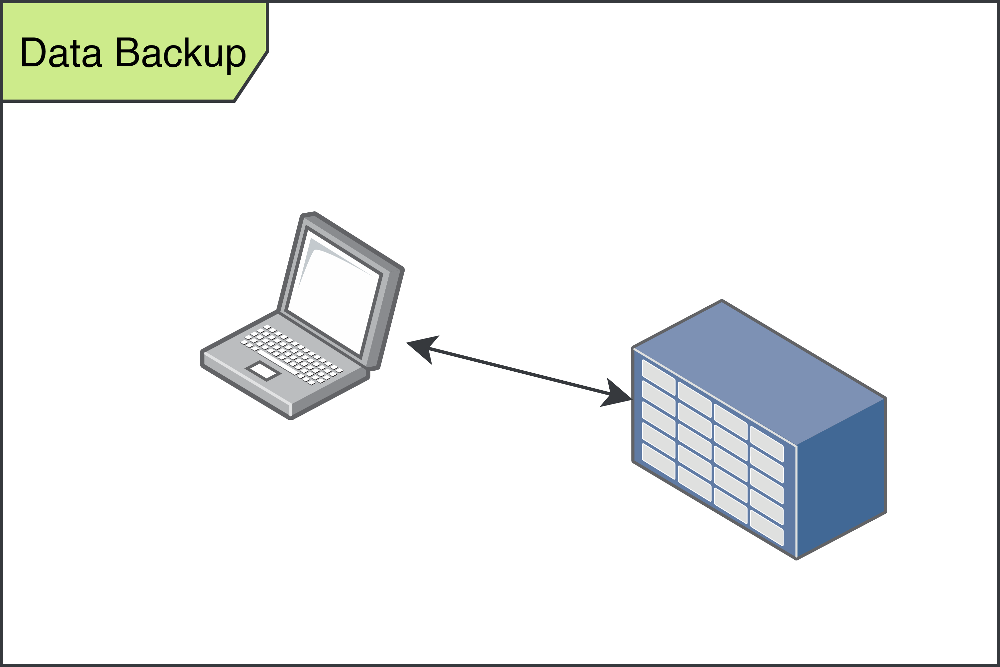
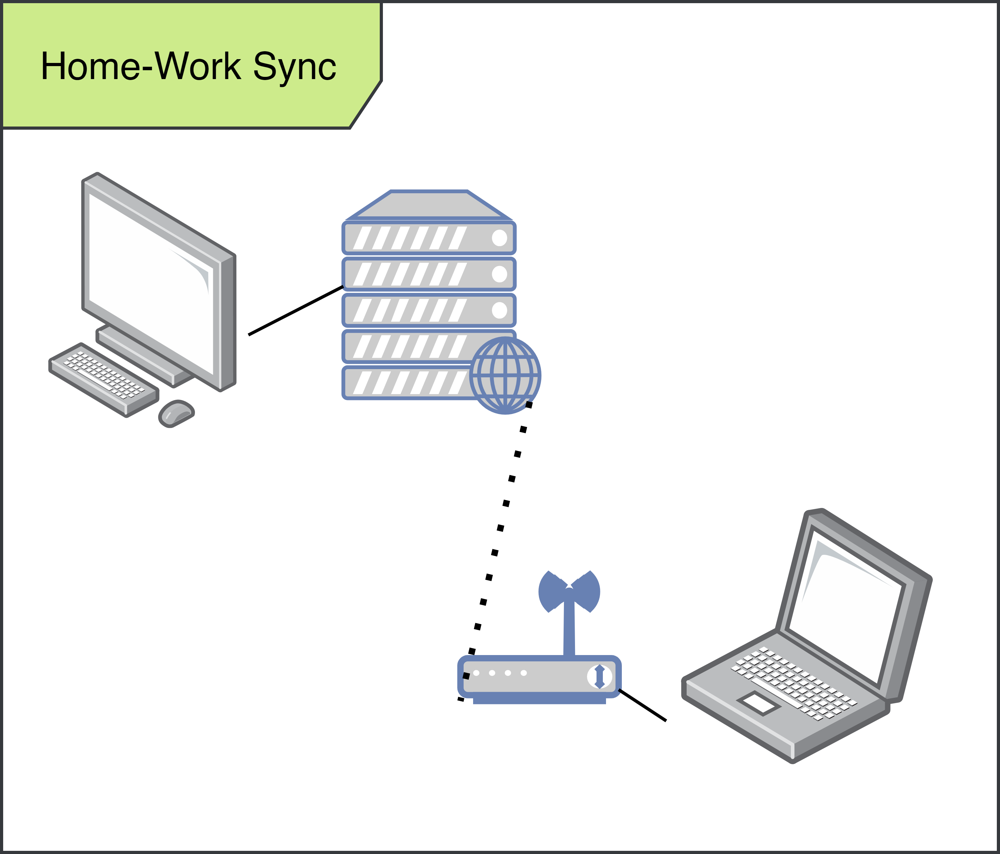
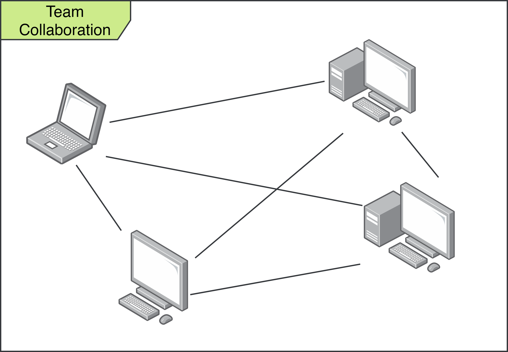
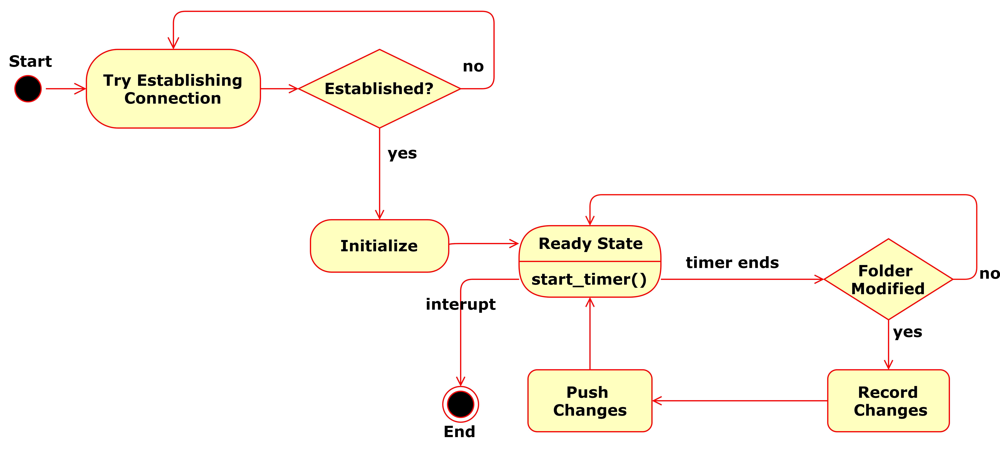
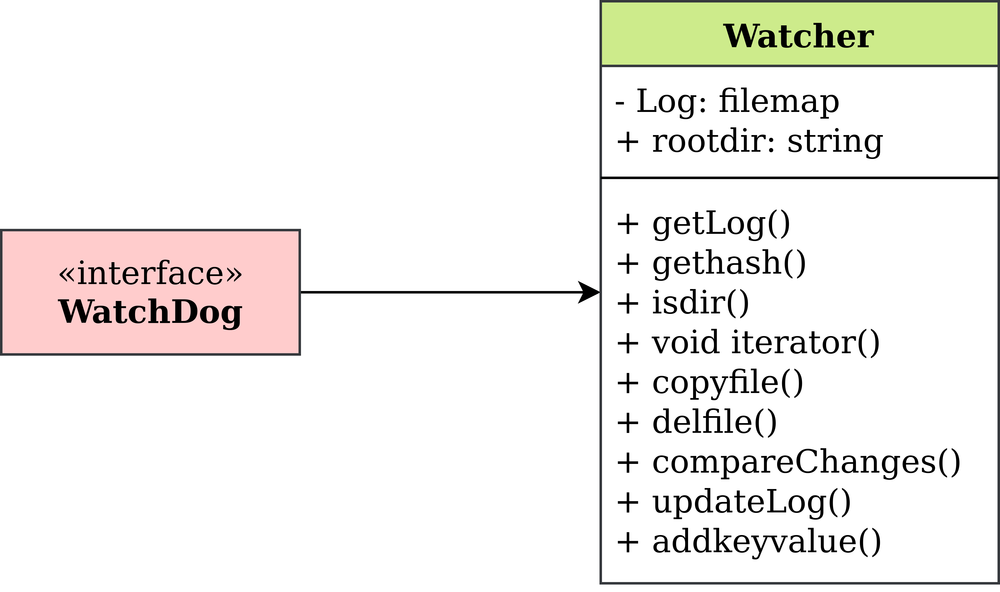
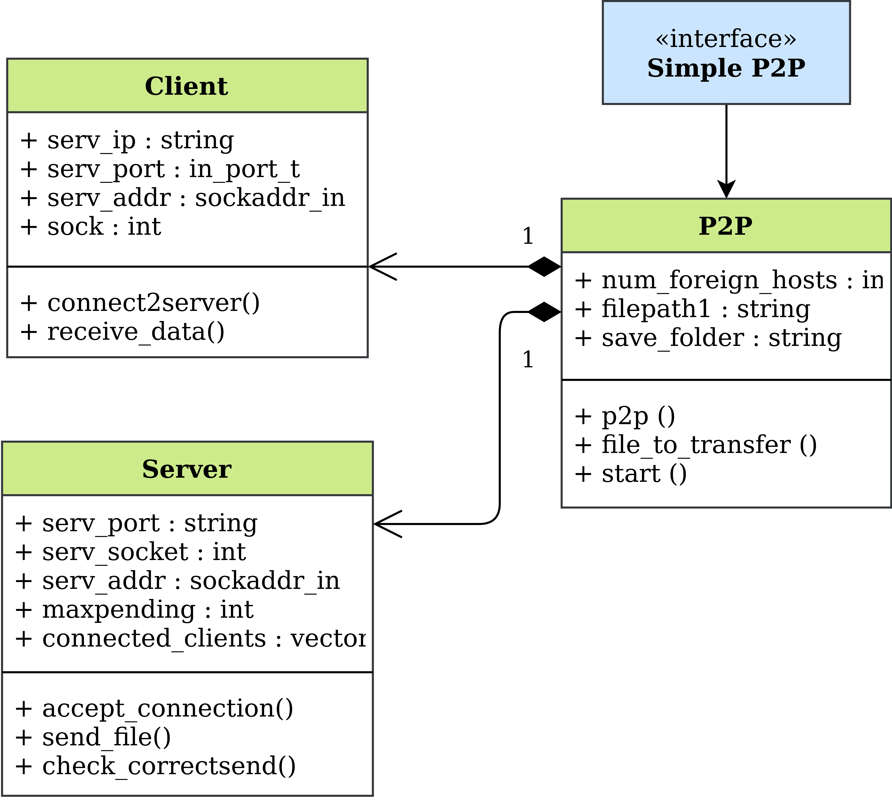

## RepositorySynchornizer

This repository is a part of our Operating Systems Course Project, and was colaboratively made by [Harsh Patel](https://github.com/Harshp1802), [Harshit Kumar](https://github.com/harshitkumar825), [Shivam Sahni](https://github.com/shivam15s) and [Me(Varun Jain)](https://github.com/varunjain3).

---

## Table of contents

- [Problem Statement](#problem-statement)
- [Background](#background)
- [Objectives](#objectives)
- [Use Cases](#use-cases)
- [Logic Flow](#logic-flow)
- [Results](#results)

---

## Problem Statement

While working, often a time we want our data to move with us. We want to work on the data, while not disturbing others workflow. It is important for data to synchronize with people working on it.

We aim to deliver a software that will help clients to work on their systems without worrying about data loss. This software could synchronize folders and files across multiple computers over a local area network.

This solves problems related to data backup, work - home taskflow and also team collaborations.

---

## Background

File synchronization (or syncing) in computing is the process of ensuring that computer files in two or more locations are updated via certain rules.

In one-way file synchronization, also called mirroring, updated files are copied from a source location to one or more target locations, but no files are copied back to the source location. In two-way file synchronization, updated files are copied in both directions, usually with the purpose of keeping the two locations identical to each other. In this article, the term synchronization refers exclusively to two-way file synchronization.

Synchronization is commonly used for home backups on external hard drives or updating for transport on USB flash drives. BitTorrent Sync, Dropbox and SKYSITE are prominent products. Some backup software also support real-time file sync. The automatic process prevents copying already identical files and thus can be faster and save much time versus a manual copy, and is less error prone.

---

## Objectives

Some objectives that we had while making the software-

1. Properly be able to synchronize two folders that are mutually exclusive.
2. Expanding these folders to over two separate computers.
3. Multi-Threaded mode of working.
4. Low Latency.

---

## Use Cases

### Mirroring (File Backup)

  

### Home - Work Collaboration

  

### Team Collaboration

  

---

## Logic Flow

We have 2 major parts in the project, The WatchDog, and the P2P File-Transferer.

The WatchDog constantly checks if there are any changes for it to synchronise with other clients.
If any changes are found by the WatchDog, these changes are notified to the others using the P2P server thread, while on the other location, The P2P client thread is waiting to recieve files and update in its folder.

One can understand the flow looking at the folloing diagram.

---

## Code Structure

The 2 major parts of the code are the WatchDog and the P2P File Transferer.

The Watchdog is a class with the following utitlities -

  

The P2P file is a dervied class and contains the Client and Server Classes, The following diagram explians it in more detail-

  

---

## Results

The Software works perfectly in our observations and some assupmtions that we have taken. This software works on a local connection but can be expanded over internet given resources.

The most important assumption that we have taken is that no computer once connected on the mesh disconnects from the mesh.

---

##### \*This project was built for academic and learning purposes to understand the fundamental problems faced while coding at the Operating System Level.
